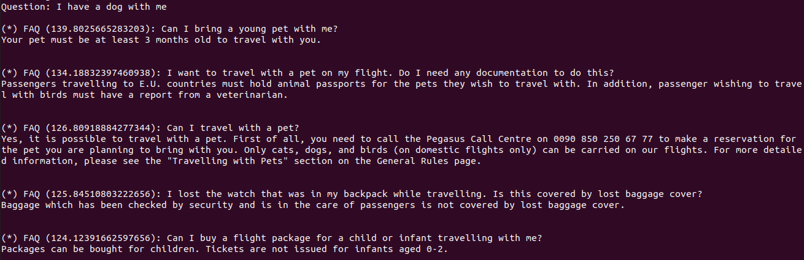

# FAQ Question Answer Similarity Search

While browsing the FAQ section of the Pegasus Airlines website, implementing a simple search app came to my mind. Works pretty fast.

- Model: [clips/mfaq](https://huggingface.co/clips/mfaq)
- Data Source: [flypgs.com](https://www.flypgs.com/)
  - Disclaimer: I hereby declare that I have no association or affiliation with Pegasus Airlines. Furthermore, any data collected from the flypgs.com website is not owned or attributable to me.



## Install

```bash
$ sudo apt install python3.10-venv
$ python3.10 -m venv venv
$ source venv/bin/activate
$ pip install -U pip
$ pip install sentence-transformers transformers
```

## Run

```bash
$ source venv/bin/activate
# On GPU:
$ python app.py
# On CPU:
$ CUDA_VISIBLE_DEVICES= python app.py
```

Some questions to ask:

- How to check in?
- What is my baggage allowance?
- How to cancel flights?
- I have a dog with me
- Do I have to buy a ticket for my baby?